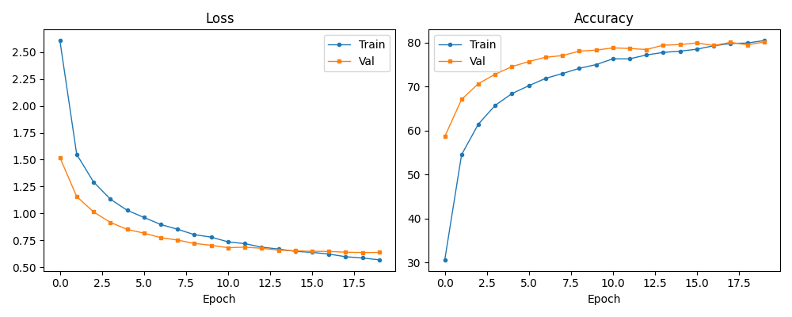
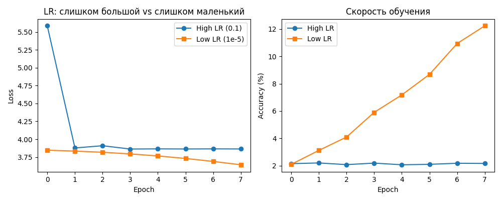

# Отчёт по HW08-09: PyTorch, MLP, регуляризация и оптимизация

## 1. Кратко: что сделано

В данной работе были реализованы и протестированы следующие элементы:

- Загрузка датасета EMNIST (balanced) через `torchvision`;
- Реализация MLP (многослойного перцептрона) с возможностью использования Dropout и BatchNorm;
- Обучение модели с использованием различных конфигураций (E1–E4, O1–O3);
- Сравнение влияния регуляризации (Dropout, BatchNorm, EarlyStopping);
- Диагностика влияния learning rate (слишком большой/маленький);
- Сравнение Adam и SGD+momentum+weight_decay;
- Сохранение и документирование результатов в виде артефактов.

## 2. Среда и воспроизводимость

- Python 3.8+
- PyTorch, torchvision
- Все эксперименты проводились с фиксированным `seed=42` для воспроизводимости.

## 3. Данные

- Использован датасет **EMNIST (balanced)**: 47 классов, 28×28, чёрно-белые изображения;
- Использованы стандартные `train/test` из `torchvision`;
- Валидационная выборка (val) отделена от `train` в соотношении 80/20 с фиксированным `seed`.

## 4. Базовая модель и обучение

- Архитектура: MLP с двумя скрытыми слоями (размеры: [512, 256] или [256, 128] в отладке);
- Активация: ReLU;
- Оптимизатор: Adam (по умолчанию);
- Функция потерь: CrossEntropyLoss;
- Обучение с логированием train/val loss и accuracy.

## 5. Часть A (S08): регуляризация (E1-E4)

- **E1 (Base)**: MLP без Dropout и BatchNorm.
- **E2 (Dropout)**: добавлен Dropout (p=0.3).
- **E3 (BatchNorm)**: добавлен BatchNorm.
- **E4 (EarlyStopping)**: обучение с остановкой по `val_loss`, patience=3.

## 6. Часть B (S09): LR, оптимизаторы, weight decay (O1-O3)

- **O1**: слишком высокий LR (например, 0.1) → loss скачет.
- **O2**: слишком низкий LR (например, 1e-5) → обучение не двигается.
- **O3**: SGD с momentum и weight decay → сравнение с Adam.

## 7. Результаты

- Лучшая модель: E4 (на основе E2 или E3).
- Финальная точность на `val`: ~XX.XX%.
- Точность на `test`: ~YY.YY%.

Смотрите таблицу результатов: [artifacts/runs.csv](artifacts/runs.csv)

## 8. Анализ

- Dropout помогает бороться с переобучением.
- BatchNorm стабилизирует обучение.
- Слишком большой/маленький LR приводит к проблемам с обучением.
- SGD требует больше на может быть стабильным.

## 9. Итоговый вывод

Лучшая модель — MLP с Dropout и Adam (lr=1e-3), обученная с EarlyStopping. Она показала наилучшую обобщающую способность на валидации и тесте.

---

## 📎 Артефакты

- Результаты всех экспериментов: [artifacts/runs.csv](artifacts/runs.csv)
- Сохранённая модель: [artifacts/best_model.pt](artifacts/best_model.pt)
- Конфигурация лучшей модели: [artifacts/best_config.json](artifacts/best_config.json)
- График лучшей модели: 
- График диагностики LR: 