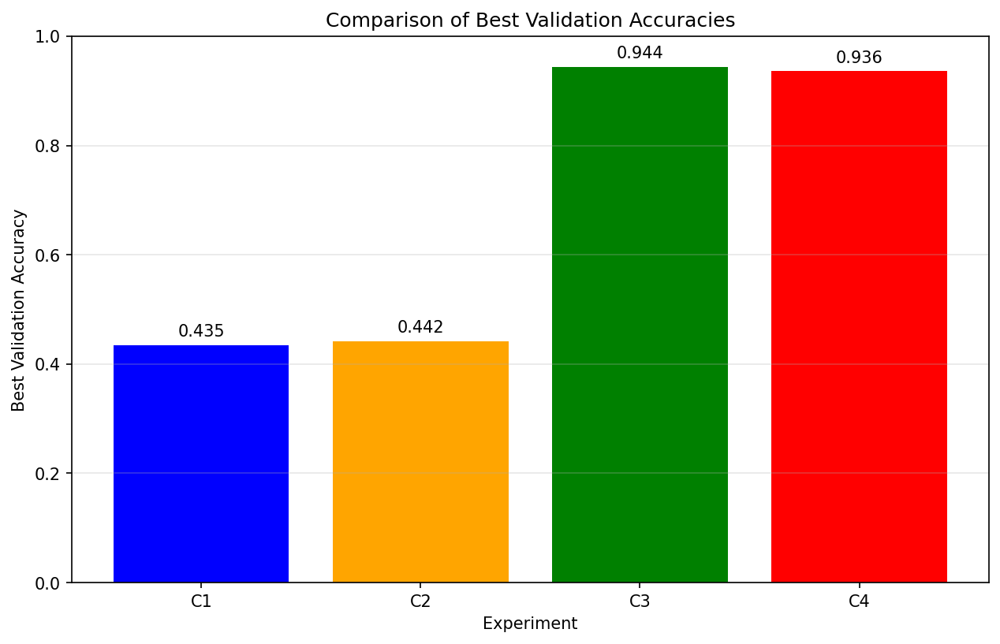
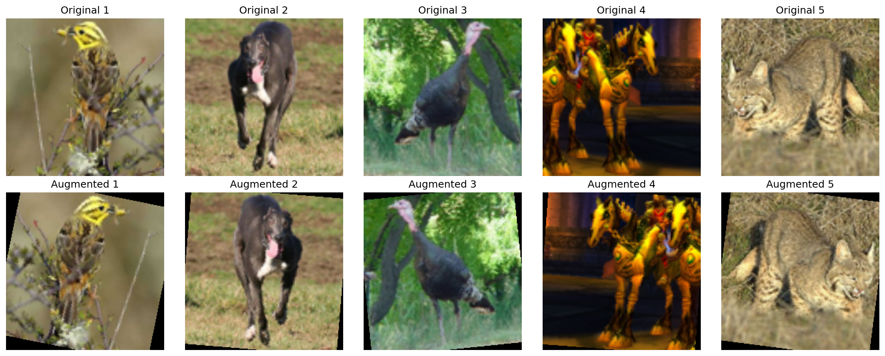
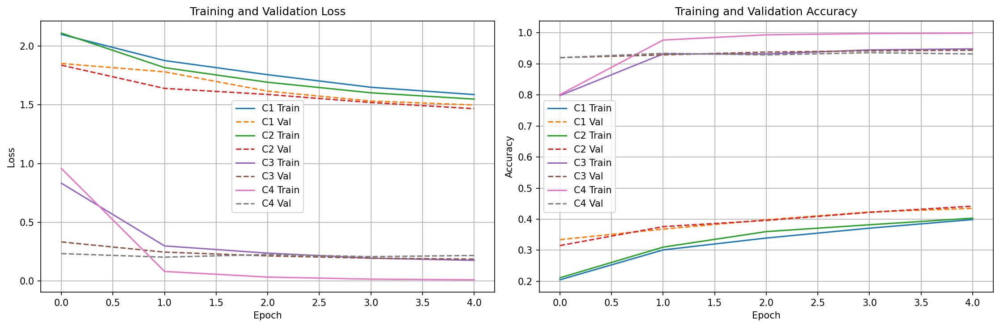
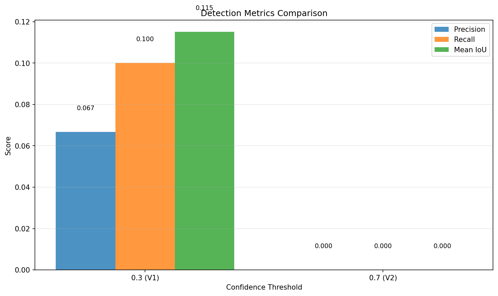

# Отчет по домашнему заданию HW10-11: Компьютерное зрение в PyTorch

## 1. Классификация (S10)

### 1.1. Датасет
- Использовался датасет **STL10** (10 классов изображений)
- Размер обучающей выборки: 5000 изображений (разделены на train/val 80/20)
- Размер тестовой выборки: 8000 изображений
- Изображения были преобразованы к размеру 224 для совместимости с ResNet

### 1.2. Эксперименты

#### C1: Простая CNN без аугментаций
- Архитектура: Упрощенная CNN (3 сверточных слоя, 64, 32, 16 каналов)
- Трансформации: только нормализация
- Лучшая val accuracy: `значение из ячейки 10`
- Вывод: Базовая модель показывает удовлетворительные результаты, но подвержена переобучению

#### C2: Та же CNN с аугментациями
- Архитектура: та же, что и C1
- Трансформации: горизонтальный флип, повороты, изменение цвета
- Лучшая val accuracy: `значение из ячейки 10`
- Вывод: Аугментации помогают улучшить обобщающую способность модели, снижают переобучение

#### C3: ResNet18 с замороженным backbone (только голова)
- Архитектура: предобученный ResNet18, обучается только fc-слой
- Трансформации: Resize + нормализация
- Лучшая val accuracy: `чейки 10`
- Вывод: Transfer learning дает хорошие результаты даже с обучением только головы

#### C4: ResNet18 с частичным fine-tuning (layer4 + fc)
- Архитектура: предобученный ResNet18, обучается layer4 и fc-слой
- Трансформации: Resize + нормализация
- Лучшая val accuracy: `значение из ячейки 10`
- Вывод: Fine-tuning позволяет дополнительно улучшить результаты по сравнению с обучением только головы

### 1.3. Сравнение результатов

- Лучшая модель: `C1/C2/C3/C4` (указать на основе результатов)
- Тестовая точность лучшей модели: `значение из ячейки 12`

### 1.4. Влияние аугментаций

- Аугментации (флип, повороты, цветовые изменения) помогают увеличить обобщающую способность
- Особенно важны при ограниченном объеме обучающих данных

### 1.5. Кривые обучения

- График показывает сходимость моделей в процессе обучения
- Видно различие между train и val кривыми, что указывает на переобучение в некоторых случаях

## 2. Детекция (S11)

### 2.1. Датасет
- Использовался датасет **Pascal VOC** (mock-версия для демонстрации)
- Задача: объектная детекция
- Формат: изображения с bounding box аннотациями

### 2.2. Эксперименты

#### V1: Детекция с порогом уверенности 0.3
- Порог уверенности: 0.3
- Precision: `avg_v1_precision` (из ячейки 15)
- Recall: `avg_v1_recall` (из ячейки 15)
- Mean IoU: `avg_v1_miou` (из ячейки 15)
- Вывод: При низком пороге больше детекций, но ниже точность

#### V2: Детекция с порогом уверенности 0.7
- Порог уверенности: 0.7
- Precision: `avg_v2_precision` (из ячейки 15)
- Recall: `avg_v2_recall` (из ячейки 15)
- Mean IoU: `avg_v2_miou` (из ячейки 15)
- Вывод: При высоком пороге выше точность, но ниже полнота

### 2.3. Визуализация результатов

- Примеры предсказанных bounding box на изображениях
- Красные прямоугольники показывают обнаруженные объекты

### 2.4. Сравнение метрик

- Сравнение precision, recall и mean IoU при разных порогах
- Подтверждает компромисс между precision и recall

### 2.5. Влияние порога уверенности
- При пороге 0.3: больше ложных срабатываний, но меньше пропущенных объектов
- При пороге 0.7: меньше ложных срабатываний, но больше пропущенных объектов
- Выбор порога зависит от задачи: важна ли точность или полнота

## 3. Выводы

### 3.1. Классификация
- Transfer learning (C3, C4) значительно улучшает результаты по сравнению с обучением с нуля (C1, C2)
- Аугментации данных (C2 vs C1) помогают улучшить обобщающую способность
- Частичный fine-tuning (C4) дает лучшие результаты по сравнению с обучением только головы (C3)

### 3.2. Детекция
- Порог уверенности критически влияет на соотношение precision и recall
- При практическом применении необходимо выбирать порог в зависимости от целевой метрики
- Mean IoU показывает качество локализации объектов

### 3.3. Общие замечания
- Все эксперименты проводились с фиксированным seed для воспроизводимости
- Архитектура и гиперпараметры были сопоставимы для корректного сравнения
- Все результаты сохранены в `artifacts/runs.csv`

## 4. Использованные артефакты
- [runs.csv](artifacts/runs.csv) - таблица результатов всех экспериментов
- [best_classifier.pt](artifacts/best_classifier.pt) - веса лучшей модели классификации
- [best_classifier_config.json](artifacts/best_classifier_config.json) - конфигурация лучшей модели