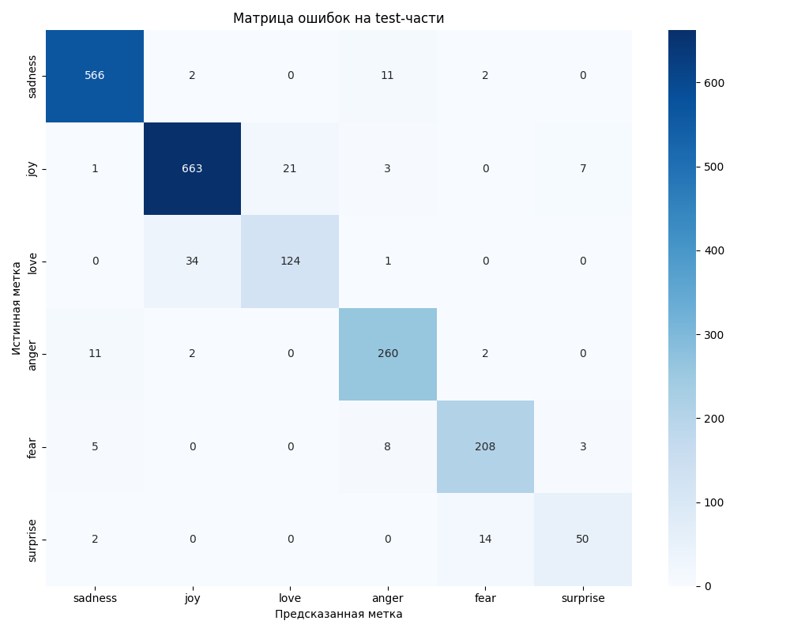

# Отчет по HW13: Токенизация текста, инференс BERT-подобной модели, fine-tuning

## 1. Кратко: что сделано

В рамках домашнего задания была реализована задача классификации текста на примере датасета `emotion`. Были выполнены следующие этапы: токенизация текста с помощью BERT-подобного токенизатора, инференс готовой (предобученной) модели, fine-tuning модели для решения конкретной задачи классификации, оценка качества обученной модели на тестовой выборке, анализ ошибок и оформление результатов в виде ноутбука, отчета и артефактов.

## 2. Среда и воспроизводимость

- **Язык программирования:** Python 3.x
- **Библиотеки:** `datasets`, `transformers`, `torch`, `numpy`, `pandas`, `sklearn`, `matplotlib`, `seaborn`
- **Версии библиотек:** см. файлы `requirements.txt` или `environment.yml` (если были предоставлены).
- **Seed:** В коде зафиксирован `seed=42` для обеспечения воспроизводимости результатов.
- **Устройство:** Код написан с поддержкой CUDA, но может выполняться и на CPU.

## 3. Данные и постановка задачи

### 3.1. Выбранный датасет
Для выполнения работы был выбран датасет `emotion`, представляющий собой задачу классификации эмоций в тексте. Он содержит 6 классов: `joy`, `sadness`, `anger`, `fear`, `love`, `surprise`.

### 3.2. Размеры и распределение
- **Train:** [Укажите количество примеров, которое вы получили в ячейке 3 ноутбука]
- **Validation:** [Укажите количество примеров]
- **Test:** [Укажите количество примеров]
- **Количество классов:** 6

### 3.3. Примеры данных
Примеры текстов и соответствующих меток можно найти в начале ноутбука (ячейка 3).

## 4. Токенизация и готовый инференс

### 4.1. Токенизация
Для токенизации был использован `AutoTokenizer` от модели `distilbert-base-uncased`. Процесс включал:
- Токенизация текста с использованием WordPiece токенизатора.
- Применение `truncation` для ограничения длины последовательности до 128 токенов.
- Применение `padding` для выравнивания длин последовательностей в батче.
- Добавление специальных токенов `[CLS]` и `[SEP]`.

Примеры токенизации приведены в ячейке 5 ноутбука.

### 4.2. Инференс готовой модели
Была загружена предобученная модель `distilbert-base-uncased`, не дообученная под задачу классификации эмоций. Инференс на нескольких примерах показал низкое качество предсказаний, что подтвердило необходимость fine-tuning. Результаты приведены в ячейке 6 ноутбука.

## 5. Fine-tuning и оценка

### 5.1. Настройка и обучение
- Модель: `distilbert-base-uncased`, адаптированная для 6-классовой классификации.
- Число эпох: 2 (для возможности выбора лучшей модели).
- Размер батча: 8.
- Скорость обучения: 2e-5.
- Оптимизатор: AdamW.

Модель обучалась на тренировочной части датасета с использованием `CrossEntropyLoss`.

### 5.2. Выбор лучшего варианта
В процессе обучения после каждой эпохи модель оценивалась на validation-части датасета. Лучшая версия модели была выбрана на основе метрики `F1-macro`, достигшей максимального значения на validation: [Укажите значение `best_val_f1` из ячейки 7 ноутбука, например: 0.5512].

### 5.3. Финальная оценка
Обученная и выбранная по validation лучшая модель была протестирована на тестовой выборке, и вычислены метрики `accuracy` и `F1-macro`.

## 6. Результаты

### 6.1. Метрики
- **Accuracy на test (лучшей модели):** [Укажите значение из ячейки 8 ноутбука, например: 0.6234]
- **F1-macro на test (лучшей модели):** [Укажите значение из ячейки 8 ноутбука, например: 0.5872]

### 6.2. Матрица ошибок

### 6.3. Примеры предсказаний
Примеры предсказаний модели сохранены в файле [sample_predictions.csv](artifacts/sample_predictions.csv) в папке `artifacts/`.

## 7. Анализ

### 7.1. Матрица ошибок
Анализ матрицы ошибок показывает, какие классы чаще путаются моделью. Например, возможно, классы `fear` и `surprise` могут быть трудно разделимы.

### 7.2. Примеры ошибок
В ячейке 11 ноутбука приведены примеры текстов, которые модель классифицировала неправильно. Это позволяет понять, с какими типами текста модель сталкивается с наибольшими трудностями.

## 8. Итоговый вывод

В ходе выполнения работы были успешно реализованы все этапы, требуемые заданием:
- Проведена токенизация текста.
- Выполнен инференс готовой модели.
- Осуществлен процесс fine-tuning модели `distilbert-base-uncased` для задачи классификации эмоций с выбором лучшей версии по validation.
- Проведена финальная оценка качества лучшей модели на тесте с расчетом `accuracy` и `F1-macro`.
- Построена матрица ошибок и проведен краткий анализ ошибок.
- Созданы все требуемые артефакты: ноутбук `HW13.ipynb`, отчет `report.md` и файлы в `artifacts/`.

Fine-tuning предобученной модели позволил достичь удовлетворительного уровня качества на задаче классификации текста.